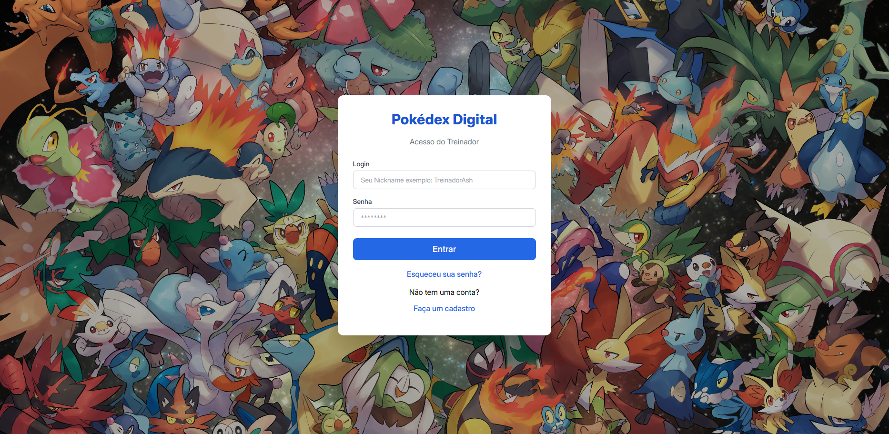

# POKEGO-FRONT: APLICAÇÃO CLIENTE (ANGULAR + TAILWIND)



## Visão Geral

Esta é a aplicação Front-End desenvolvida em **Angular** para o **Desafio Técnico Fullstack da empresa Kogui**. O projeto consome a **PokeGo-API** (Backend Flask/Docker) para listar Pokémon, gerenciar o estado de usuário (login/cadastro) e persistir os dados de Favoritos e Equipe de Batalha.

- **Framework:** Angular (utilizando Standalone Components).
- **Estilização:** Tailwind CSS (seguindo a preferência do usuário).
- **Comunicação:** `HttpClient` com Interceptor JWT.

---

## 2. Como Iniciar o Projeto

### Pré-requisitos

1.  O **Backend (`PokeGo-API`) Verifique no meu repositório ou nesse link: https://github.com/diego1999dd/PokeGo-API** deve estar rodando primeiro na porta **`8000`** (utilize `docker-compose up` no repositório do Backend).
2.  Node.js e npm (ou pnpm/yarn).

### Inicialização do Servidor Angular

1.  **Instalar Dependências:**
    ```bash
    npm install
    # ou pnpm install / yarn install
    ```
2.  **Iniciar o Servidor:**
    ```bash
    npm run start
    ```
3.  Acesse no navegador: `http://localhost:4200/`

---

## 3. Funcionalidades Detalhadas (Telas)

O Front-End implementa todas as telas obrigatórias do desafio: Login, Listagem Geral, Listagem de Favoritos e Exibição da Equipe de Batalha.

### 3.1. Telas de Acesso (Rotas Públicas)

| Rota                   | Componente                | Descrição                                                                                                                          |
| :--------------------- | :------------------------ | :--------------------------------------------------------------------------------------------------------------------------------- |
| **`/login`**           | `LoginComponent`          | Tela principal de acesso.                                                                                                          |
| **`/register`**        | `RegisterComponent`       | Tela de cadastro de novos usuários. **Destaque:** O **primeiro usuário** registrado é automaticamente definido como Administrador. |
| **`/forgot-password`** | `ForgotPasswordComponent` | Formulário para redefinição de senha via Login ou Email.                                                                           |

### 3.2. Pokédex Digital (Listagem Geral)

Rota protegida por `authGuard` (`/pokemon`).

- **Listagem de Cards:** Apresentação responsiva dos Pokémon, mostrando ID, Imagem, Nome e **Status Base** (HP, Ataque e Defesa) com barras de progresso para visualização rápida.
- **Contadores Dinâmicos:** Exibe o número total de Pokémon, e a contagem de **Favoritos** e **Grupo de Batalha** do usuário logado.
- **Filtros por Status (Seções Mínimas):** Botões de filtro na listagem que atuam como as "seções dedicadas" do desafio:
  - **Todos:** Exibe todos os Pokémon (com filtros de tipo opcionais).
  - **Favoritos:** Exibe apenas os Pokémon marcados com a tag `Favorito` (listagem de Favoritos).
  - **Grupo de Batalha:** Exibe apenas os Pokémon marcados com a tag `GrupoBatalha` (exibição da Equipe de Batalha).
- **Filtros por Tipo:** Botões de filtro que permitem ao usuário listar Pokémon por Tipos (Fogo, Água, Grama, etc.).

### 3.3. Gerenciamento de Status (Cards Interativos)

Cada card possui botões e indicadores visuais para as regras de negócio:

- **Favoritar (`toggleFavorite`):** O usuário pode marcar/desmarcar qualquer Pokémon. Não há limite imposto no Front-End, sendo o controle do Backend o principal.
- **Grupo de Batalha (`toggleTeam`):** O usuário pode selecionar até **6 Pokémon**. O Front-End exibe um `alert` caso o limite do Backend seja atingido.
- **Destaque Visual:** Os cards de Favoritos e Membros da Equipe recebem uma borda e ícones especiais (`★` e `E`) para destacá-los visualmente.

### 3.4. Painel de Administração (Diferencial)

Rota protegida (`/admin`), acessível apenas se o usuário tiver o status `IsAdmin: true`.

- **Gestão de Treinadores:** Lista todos os usuários cadastrados (Nome, Email, ID e Status Admin).
- **Reset de Senha:** Permite que o administrador insira uma nova senha para qualquer usuário (cumpri o requisito opcional "Painel para RESET da Senha de Acesso do Usuário").
- **Gestão de Privilégios:** Permite promover (`PROMOVER`) ou remover (`REMOVER`) o status de Admin de outros usuários. (Possui lógica para prevenir que o Admin remova o próprio status de segurança).

---

## 4. Estrutura e Padrões de Código

- **Angular CLI (v20.3.6):** Utilizado para a estrutura do projeto e _bundling_.
- **Serviços:** Lógica de negócio e comunicação com a API centralizadas em `auth.service.ts`, `pokemon.service.ts` e `admin.service.ts`.
- **Formulários:** Uso de `ReactiveFormsModule` com validações para todas as telas de entrada de dados.
- **Melhoria Semântica:** O componente principal utiliza a tag `<main>` (no `app.component.html`) para englobar as rotas, melhorando a semântica do HTML.
